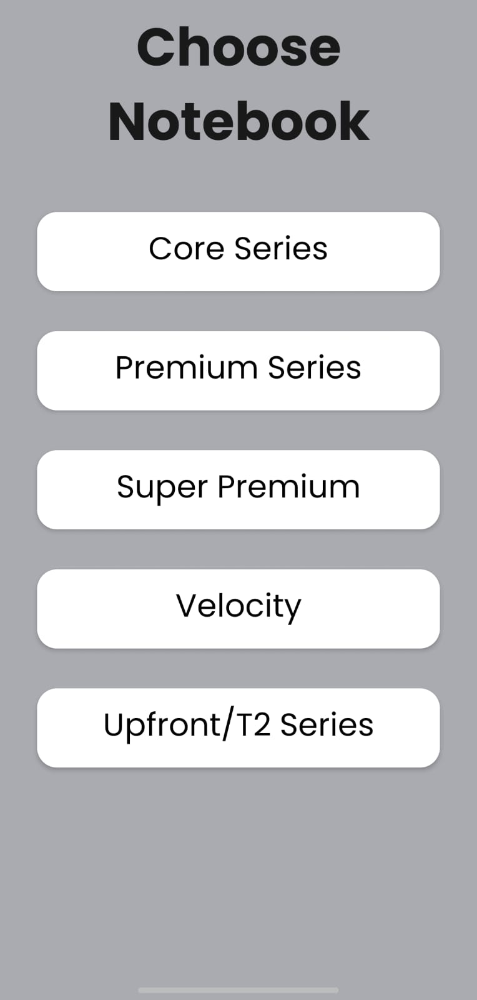
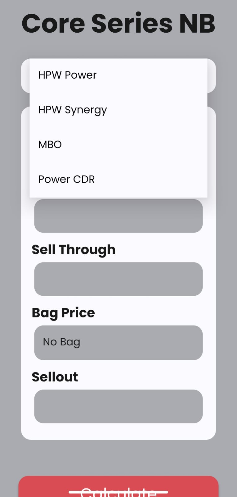
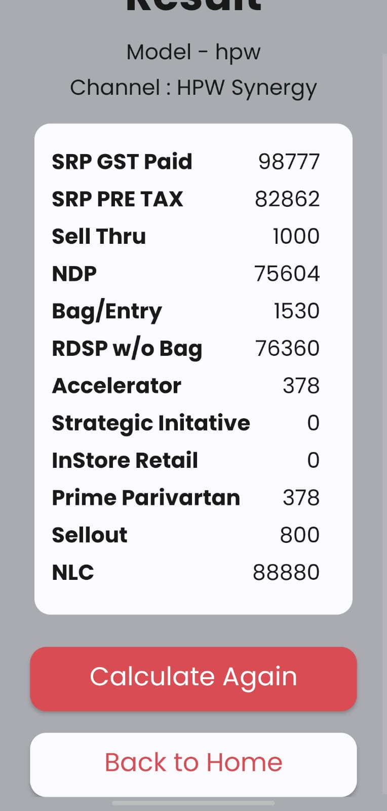

# Payout

**Payout** is a user-friendly Android application designed to assist in calculating the final price of notebooks. The app helps sales professionals by taking various inputs such as GST paid, sell-through amount, and other technical details to calculate the final price for a specific notebook.

## Features

- **User-Friendly Interface**: Simple and intuitive UI for easy navigation.
- **Input Fields**: Users can input details such as GST paid, sell-through amount, and other technical specifications.
- **Price Calculation**: Calculates the final price based on the provided inputs.
- **Multi-Page Workflow**: Smooth transition from input collection to final price calculation.

## How It Works

1. **Initial Input Page**:
   - Users enter details about the notebook, including series and other specifications.
   - Click a button to proceed to the next page.

2. **Calculation Page**:
   - Users input additional details such as GST paid and sell-through amount.
   - The application calculates the final price based on the entered data.


## Getting Started

To set up the project on your local machine:

1. Clone the repository:
   ```bash
   git clone <[repo-url](https://github.com/DevilSpecial/Payout.git)>

2. Open the project in Android Studio.   
  
3. Follow the setup instructions provided in the project to configure any necessary dependencies.

## Installation

1. Install any required dependencies listed in the project.

2. Build and run the application on your local machine or emulator.

## Screenshots

- **Landing Page**:
  
  
  - **Calculation Page**:
  

- **Result Page**:
  

## Future Enhancements

- **Additional Calculation Features**: Include more parameters and calculations based on user feedback.

- **Improved UI/UX**: Enhance the user interface and experience based on real-world usage.

- **Export/Save Functionality**: Allow users to save or export the calculated results.


